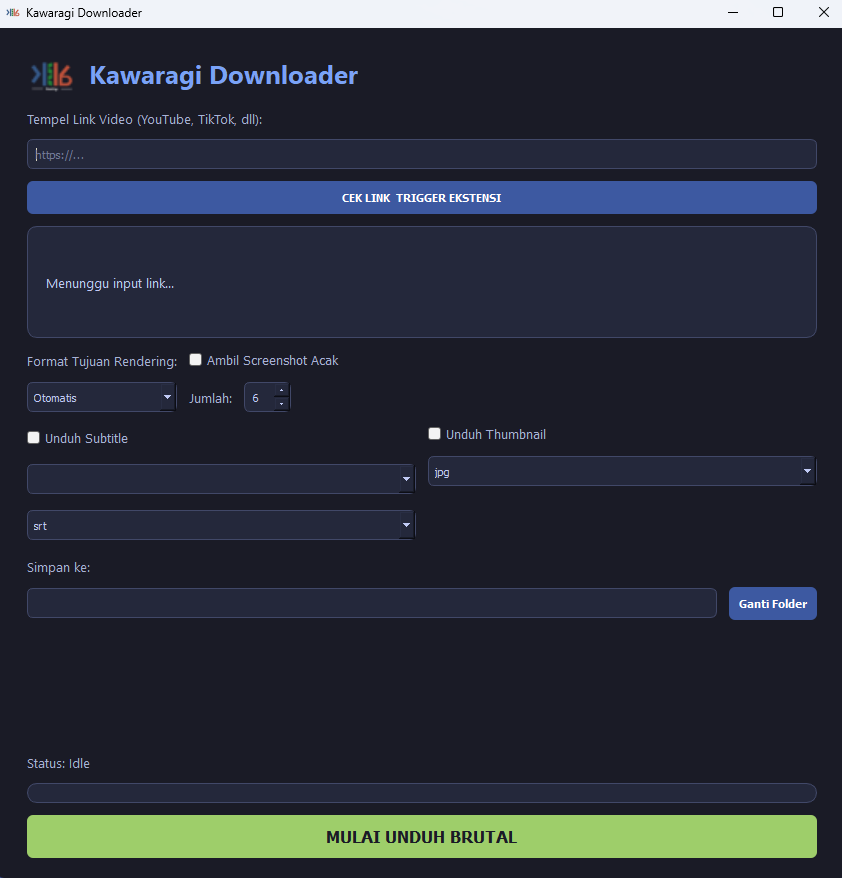
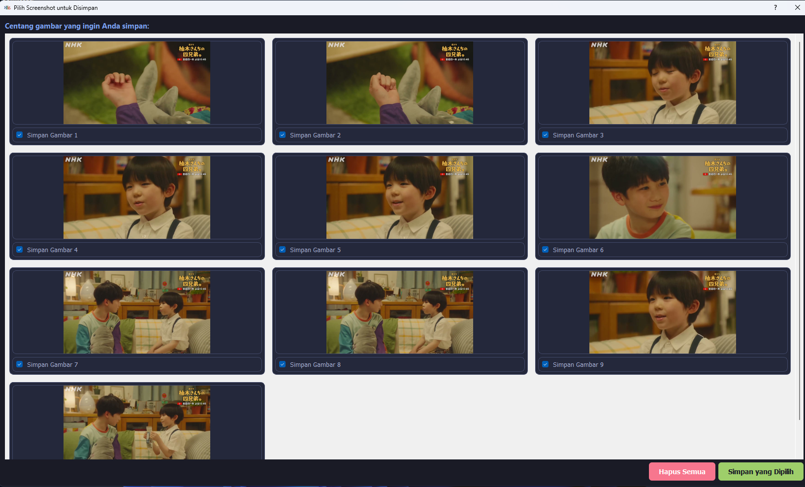

<div align="center">
  

  # Kawaragi Downloader 🚀
  
  **Aplikasi pengunduh video hybrid super tangguh dengan sistem anti-blokir dan post-processing cerdas.**

  
  
  
  

  [⬇️ Download Installer Terbaru](#-cara-instalasi) • [🐛 Lapor Bug](../../issues)
</div>

---

## 🌟 Kenapa Kawaragi Downloader?
Kawaragi Downloader bukan sekadar GUI biasa untuk `yt-dlp`. Aplikasi ini dirancang untuk melewati pemblokiran ketat (seperti proteksi bot YouTube) menggunakan **Bridge Extension**, serta dilengkapi dengan mesin **FFmpeg** internal untuk merender video mentah ke format apa pun yang Anda inginkan secara otomatis.

## ✨ Fitur Utama
* 🛡️ **Sistem Anti-Blokir (Bridge Extension):** Dilengkapi ekstensi Chrome pendamping untuk menyinkronkan *cookies* secara otomatis agar unduhan tidak diblokir oleh server.
* 🎞️ **Post-Processing Universal:** Unduh kualitas tertinggi apa pun dari server, lalu biarkan FFmpeg merendernya dengan rapi ke **MP4, WebM, MP3, atau AAC**.
* 📸 **Smart Screenshot Preview:** Ambil cuplikan gambar (JPG) secara acak di sepanjang durasi video, dan pilih mana yang ingin disimpan melalui UI Preview interaktif.
* 📝 **Ekstraksi Lengkap:** Dukungan penuh untuk mengunduh **Subtitle** (SRT, VTT, ASS) dan **Thumbnail** beresolusi tinggi (JPG, PNG, WebP).
* 🎨 **Modern & Seamless UI:** Antarmuka responsif yang elegan dengan skema warna *Tokyo Night*.

---

## 📸 Tangkapan Layar (Screenshots)
*(Ganti URL gambar di bawah ini dengan screenshot aplikasi Anda)*

| Tampilan Utama | Fitur Smart Screenshot |
|:---:|:---:|
|  |  |
---

## 🚀 Cara Instalasi

### Opsi 1: Menggunakan Installer (Direkomendasikan untuk Pengguna Windows)
1. Pergi ke halaman **[Releases](../../releases)**.
2. Unduh file `Kawaragi_Setup_v1.0.exe`.
3. Jalankan installer dan ikuti petunjuk di layar (Tinggal *Next -> Next -> Finish*).
4. Aplikasi sudah siap digunakan lengkap dengan Shortcut di Desktop!

## 🧩 Instalasi Ekstensi (Wajib)
Karena kebijakan keamanan Google Chrome, ekstensi pendamping tidak dapat terpasang secara otomatis. Ikuti langkah mudah ini:

1. Buka Chrome dan pergi ke alamat `chrome://extensions/`.
2. Di pojok kanan atas, aktifkan **Developer mode** (Mode pengembang).
3. Klik tombol **Load unpacked** (Muat yang belum dikemas) di pojok kiri atas.
4. Cari dan pilih folder `Kawaragi-Trigger` yang berada di dalam folder instalasi aplikasi Anda (biasanya di `C:\Program Files (x86)\Kawaragi Downloader\Kawaragi-Trigger`).
5. Selesai! Ekstensi sekarang akan muncul sebagai jembatan antara Chrome dan aplikasi Desktop.

### Opsi 2: Menjalankan dari Source Code (Untuk Developer)
Pastikan Anda sudah menginstal **Python 3.8+** dan memiliki **FFmpeg** di variabel sistem (atau letakkan `ffmpeg.exe` di dalam folder root aplikasi).

1. Clone repositori ini:
   ```bash
   git clone [https://github.com/UsernameAnda/Kawaragi-Downloader.git](https://github.com/UsernameAnda/Kawaragi-Downloader.git)
   cd Kawaragi-Downloader